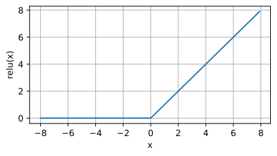
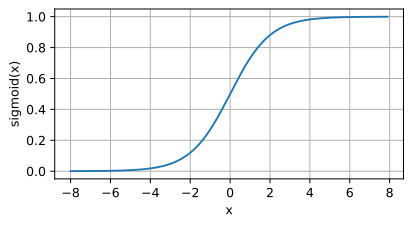
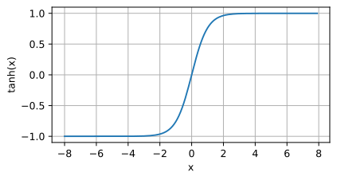

# Activation Function

## ReLU

The rectifier or ReLU (Rectified Linear Unit) activation function is an activation function defined as the positive part of its argument: 
> f(x) = max (0,x)

ReLU activation functions mitigate the vanishing gradient problem. This can accelerate convergence.

## Softmax

The softmax function, also known as softargmax or normalized exponential function, is a generalization of the logistic function to multiple dimensions. It is used in multinomial logistic regression and is often used as the last activation function of a neural network to normalize the output of a network to a probability distribution over predicted output classes, based on Luce's choice axiom. The standard (unit) softmax function is defined when *K* is greater than one by the formula
>

## Sigmoid

A sigmoid function is a mathematical function having a characteristic "S"-shaped curve or sigmoid curve. A common example of a sigmoid function is the logistic function:

>

## Softmax vs Sigmoid

Softmax is used for multi-classification in the Logistic Regression model, whereas Sigmoid is used for binary classification in the Logistic Regression model.

## Tanh

Like the sigmoid function, the tanh (hyperbolic tangent) function also squashes its inputs, transforming them into elements on the interval between -1 and 1:

>

    
## Gradient of Point-Wise Activation Function

Gradient Matrix is
- Diagonal
- Sparse
- Fast to compute and apply