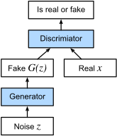

# Generative Adversarial Networks (GAN)

Two neural networks contest with each other in a game (in the form of a zero-sum game, where one agent's gain is another agent's loss). The core idea of a GAN is based on the "indirect" training through the discriminator, another neural network that is able to tell how much an input is "realistic", which itself is also being updated dynamically.[5] This basically means that the generator is not trained to minimize the distance to a specific image, but rather to fool the discriminator. This enables the model to learn in an unsupervised manner.

